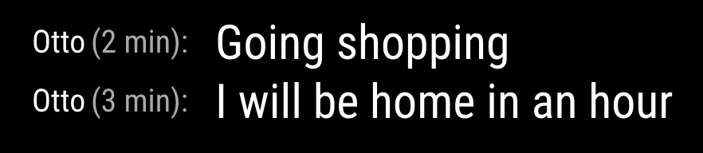

# Message to mirror

NB! This is not finished!

This is the MMM-MessageToMirror module, which is a module for MagicMirror. See my [magic](https://github.com/ottopaulsen/magic) repository for more information.



Module for [MagicMirror](https://github.com/MichMich/MagicMirror/) showing messages sent from an app.

## Installation

Go to `MagicMirror/modules` and write

    git clone git@github.com:ottopaulsen/MMM-MessageToMirror.git
    cd MMM-MessageToMirror
    npm install

## Configuration

This is the default configuration with description. Put it in the `MagicMirror/config/config.js`:

```json
                {
                	module: 'MMM-MessageToMirror',
                    position: 'middle_center',
                    disabled: false,
                	config: {
                        name: 'My Magic Mirror',
                        database: 'database-name',
                        functions: '<uri to functions>',
                        screenKey: 'MMM-MessageToMirror-WILL_BE_REPLACED_AT_FIRST_STARTUP', // MMM-MessageToMirror-WILL_BE_REPLACED_AT_FIRST_STARTUP
                        users: [
                            {email: 'user1-email', name: 'User1 Name'},
                            {email: 'user2-email', name: 'User2 Name'},
                            {email: 'user3-email', name: 'User3 Name'}
                        ],
                        newMessageSound: 'newmessage.wav'
                	}
                },
```

The `name` comes up in the app. You can use it to select between multiple mirrors.

The `database` is the name of the Firestore database you are using.

The `functions` is the URI to the server code.

The `screenKey` must be set to `MMM-MessageToMirror-WILL_BE_REPLACED_AT_FIRST_STARTUP` before you start the first time. At startup, the screen is registered in the MagicMessage server, and given a unique key. The module will automatically update the config file with the key when it is created. On subsequent startups, the key will be reused, and the legal users will be updated on the server. Screens that are not used for some time may be deleted from the server.

The `users` array contains email and display name for all users that are allowed to send messages to the mirror. Currently only Google accounts are supported.

You may change the sound used for new messages by changing the newMessageSound file, provided you also add another sound file.

See [magic-message](https://github.com/ottopaulsen/magic-message) for more details on the server and app code.

### Setting up for displaying web pages

The module can be used to send a web page from your laptop (or maybe mobile phone) to the screen and get it displayed there. For this to work, you need to share the url of the page you want to display to `https://magic.smoky.no/screens/0`. This will open the SendMessageToMirror app, where you must be logged in. The page will immediately be sent to the screen.

NB! If you have multiple screens, the '0' in the URL may be changed to send to the right screen.

One way to set up sharing is to add a share tool that allows you to share a web page by sending it to a URL. In Chrome, for example, the [AddToAny](https://chrome.google.com/webstore/detail/addtoany-share-anywhere/ffpgijchhhkhnokafdeklpllijgnbche) plugin does the job.

Configure the AddToAny plugin or other sharing tool to share the current web page with the following url:

```
https://magic.smoky.no/screens/<screen_number>
```

#### Scrolling

To scroll the web page, you may connect a `HC-SR04` distance sensor to your Raspberry Pi. Connect it following [these instructions](https://tutorials-raspberrypi.com/raspberry-pi-ultrasonic-sensor-hc-sr04/).
Hold your hand close to the sensor to scroll up, medium distance to scroll down. No hand to not scroll. Here is the configuration for the sensor:

| Parameter         | Default | Description                                                                     |
| ----------------- | ------- | ------------------------------------------------------------------------------- |
| urlTimeoutSeconds | 3600    | Time in seconds before the browser is closed. This timer resets when scrolling. |
| testScroller      | false   | Set to true to test scrolling without the sensor                                |
| scrollSpeed       | 5       | Number of pixels scrolled each time                                             |
| scrollUpCm        | 15      | Hold your hand closer then this number of cm to scroll up                       |
| scrollDownCm      | 30      | Hold your hand closer then this number of cm to scroll down                     |
| reverseScrolling  | false   | Set to true to reverse the scroll direction                                     |

## Licensed content

The default sound file for new messages, ´newmessage.wav´, is a copy of dingding.wav by ljudman, downloaded from [freesound.org](https://freesound.org/s/33244/)
